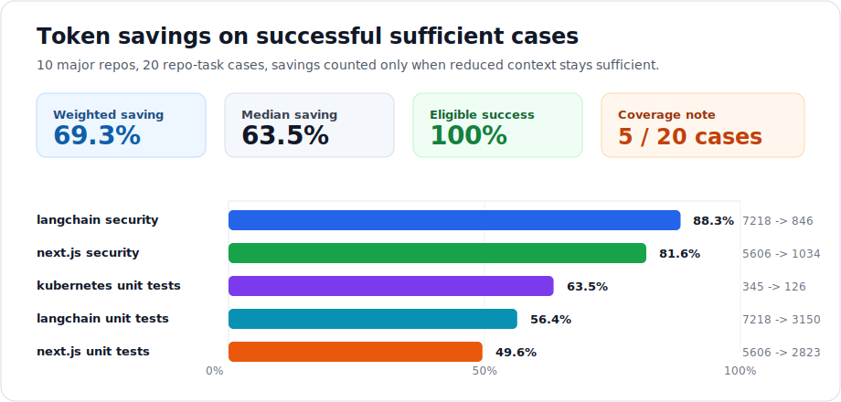

# Save-The-Token

[](https://github.com/ch040602/Save-The-Token/actions/workflows/release.yml)
[](https://www.python.org/)
[](LICENSE)

Stop paying context tokens for MCP tools and repo instructions your agent does not need.

Save-The-Token is a local-first CLI for Codex, Claude Code, Cursor, VS Code, and MCP-heavy agent setups. It scans agent config, probes MCP tool surfaces, routes repository instructions by task, and emits smaller context plans with explicit sufficiency checks.

## Measured Result

On the current 10-repo / 20-case benchmark across major repositories, Save-The-Token cuts successful sufficient contexts by **69.3% weighted average** and **63.5% median**.

<p align="center">
  
</p>

| Result | Value |
|---|---:|
| Benchmark repos | 10 |
| Repo-task cases | 20 |
| Eligible full-sufficient cases | 5 |
| Successful safe reductions | 5 |
| Success on eligible cases | 100.0% |
| Success across all cases | 25.0% |
| Weighted saving on successful cases | 69.3% |
| Median saving on successful cases | 63.5% |
| Best observed saving | 88.3% |

Successful reductions:

| repo | task | tokens | saving |
|---|---|---:|---:|
| `kubernetes/kubernetes` | `unit tests` | 345 -> 126 | 63.5% |
| `langchain-ai/langchain` | `unit tests` | 7218 -> 3150 | 56.4% |
| `langchain-ai/langchain` | `security review` | 7218 -> 846 | 88.3% |
| `vercel/next.js` | `unit tests` | 5606 -> 2823 | 49.6% |
| `vercel/next.js` | `security review` | 5606 -> 1034 | 81.6% |

The benchmark is strict: savings count only when the full context and reduced context both remain sufficient. Cases where the full context is already insufficient are reported as coverage gaps, not wins. See [docs/benchmark.md](docs/benchmark.md).

## Why It Exists

Modern coding agents load more than code:

- MCP servers can expose large tool schemas.
- `AGENTS.md`, `CLAUDE.md`, and guidance files can grow into broad instruction dumps.
- Subagents and skill loading can multiply context cost when used automatically.

Save-The-Token makes those costs visible, then recommends smaller task-specific context without silently removing the orchestrator's own instruction chain.

## Highlights

- Finds Codex, Claude Code, Claude Desktop, Cursor, and VS Code MCP config files.
- Lints MCP server entries and redacts secret-like values in output.
- Probes stdio and Streamable HTTP MCP servers for `initialize` and `tools/list`.
- Estimates tool schema tokens and emits compact schema digests.
- Routes `AGENTS.md` / `CLAUDE.md` sections by task query.
- Compresses and orders instruction evidence to reduce irrelevant context.
- Produces grounded sufficiency reports with claims, missing facts, and evidence ids.
- Generates Codex `enabled_tools` and VS Code / Cursor `enabledTools` snippets.
- Runs strict local benchmarks that separate safe savings from coverage gaps.

## What the Benchmark Actually Proves

The headline number is intentionally narrow: savings count only when the original context is sufficient and the reduced context remains sufficient.

| Benchmark signal | Why it matters |
|---|---|
| `69.3%` weighted saving on successful cases | Shows the token reduction possible after evidence routing and compression, without counting insufficient contexts as wins. |
| `100.0%` success on eligible cases | All five full-sufficient cases retained sufficiency after reduction. |
| `25.0%` success across all cases | Makes the coverage gap visible instead of hiding it inside the savings number. |
| `88.3%` best observed saving | The strongest case was `langchain-ai/langchain` security review, reduced from `7218` to `846` tokens. |
| `4` selected-only wins and `1` compression/reorder win | Most current wins come from selecting relevant context; compression and ordering are useful but still guarded. |

## Feature Map

| Feature | Command |
|---|---|
| Config discovery and MCP linting | `save-the-token scan --root .` |
| MCP tool schema measurement and digesting | `save-the-token tools --root . --budget 8000 --schema-digest` |
| Task-routed instruction evidence | `save-the-token report --root . --task "fix tests" --route-instructions` |
| Extractive compression and evidence ordering | `save-the-token report --root . --task "fix tests" --compress-instructions --order-evidence` |
| Bounded missing-fact follow-up planning | `save-the-token report --root . --task "fix tests" --active-retrieval 2` |
| Client allowlist snippets | `save-the-token slim --root . --task "review GitHub issues"` |
| Strict local benchmark run | `save-the-token benchmark --repos-dir .bench/repos --repo-commits .bench/repo-commits.json ...` |

## Install

From GitHub:

```bash
python -m pip install git+https://github.com/ch040602/Save-The-Token.git
```

From a source checkout:

```bash
git clone https://github.com/ch040602/Save-The-Token.git
cd Save-The-Token
python -m pip install .
```

For development:

```bash
python -m pip install -e ".[dev]"
```

## Quick Start

Start with read-only discovery:

```bash
save-the-token scan --root .
```

Measure MCP tool surface:

```bash
save-the-token tools --root . --budget 8000 --schema-digest
```

Route and compress repo instructions for a specific task:

```bash
save-the-token report --root . --budget 8000 --task "fix tests" --route-instructions --compress-instructions --order-evidence
```

Generate client allowlist snippets:

```bash
save-the-token slim --root . --budget 8000 --task "review GitHub issues"
```

Run the strict local benchmark shape:

```bash
save-the-token benchmark --repos-dir .bench/repos --repo-commits .bench/repo-commits.json --fallback-instruction CLAUDE.md --include-nested-instructions --json-out .bench/report.json --markdown-out .bench/report.md
```

## Commands

| command | purpose | starts MCP servers |
|---|---|---|
| `scan` | Discover and lint agent MCP config files. | No |
| `eval` | Compare full, selected, compressed, and reordered instruction context. | No |
| `benchmark` | Run strict eval across local repo checkouts. | No |
| `doctor` | Probe configured MCP servers. | Yes |
| `tools` | Measure tool count, schema tokens, relevance, and allowlist snippets. | Yes |
| `report` | Emit sufficiency reports over config, runtime, tool, and instruction evidence. | Maybe |
| `slim` | Print compact client-specific tool allowlist snippets. | Yes |

`tools`, `report`, and `slim` accept `--task "..."` to prioritize relevant tools. `report` also supports `--context-budget`, `--route-instructions`, `--include-nested-instructions`, `--include-guidance`, `--compress-instructions`, `--order-evidence`, `--active-retrieval`, `--schema-digest`, `--orchestration-advice`, and `--cache`.

## Safety Model

Save-The-Token is local-first and explicit about side effects:

- `scan`, `eval`, and `benchmark` do not start MCP servers or call MCP URLs.
- `doctor`, `tools`, `report`, and `slim` may start configured stdio MCP commands or call configured Streamable HTTP MCP URLs.
- Configured HTTP headers are forwarded only after filtering MCP-managed headers and unsafe newline values.
- Secret-like config, env, header, and raw values are redacted from JSON output.
- Claude-specific `enabledTools` output is deferred because public Claude MCP config docs do not document that field.

## Agent Skill

The repository includes a Codex skill bundle at:

```text
skills/save-the-token-mcp-doctor
```

The skill is an orchestration wrapper around the CLI. It is intentionally distributed from the repo, while the Python package ships the `save-the-token` and compatibility `slim-token` commands.

## Documentation

- [Benchmark methodology and results](docs/benchmark.md)
- [Release readiness notes](docs/release-readiness.md)
- [Agentic RAG design notes](docs/agentic-rag-design.md)
- [Agentic RAG token roadmap](docs/agentic-rag-token-roadmap.md)
- [Codex skill entry point](skills/save-the-token-mcp-doctor/SKILL.md)

## Development

```bash
python -m unittest discover -s tests -v
python -m ruff check ./src ./tests
python -m ruff format --check ./src ./tests
mypy ./src/save_the_token
python -m build
python -m twine check dist/*
```

## Current Limits

Task routing and evaluation are deterministic and lexical. The benchmark is a regression guard for required evidence and sufficiency, not a semantic answer-quality judge. Automatic config patching is intentionally deferred until the snippet flow is stable.
